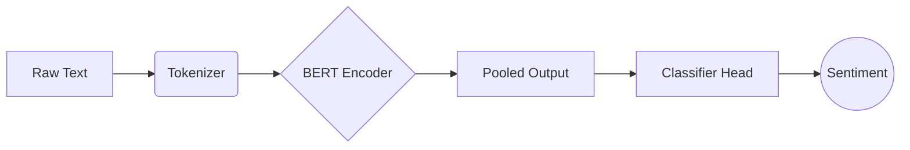
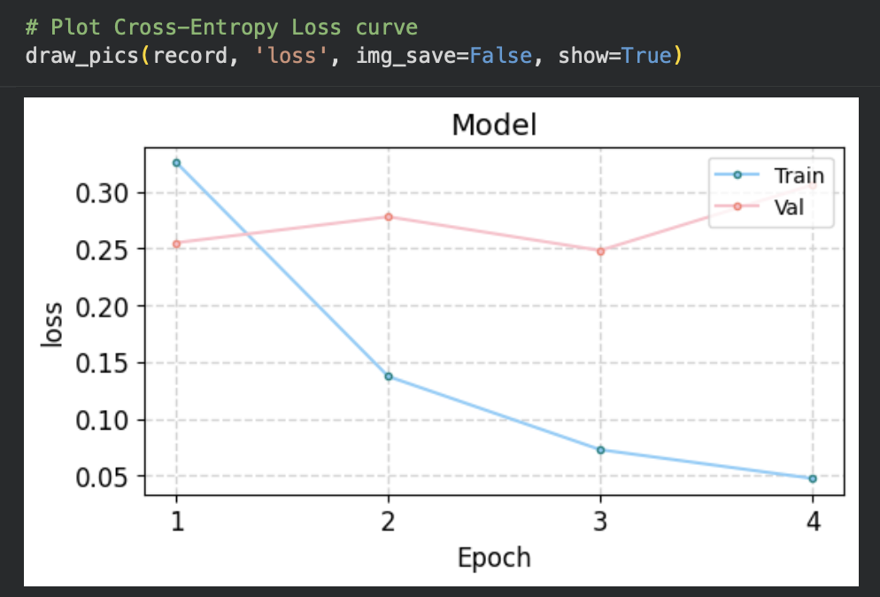
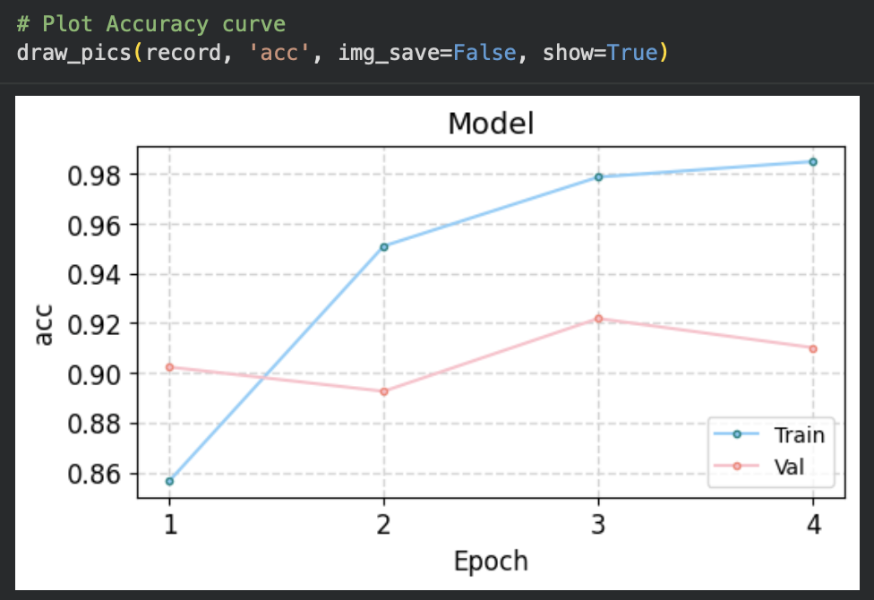
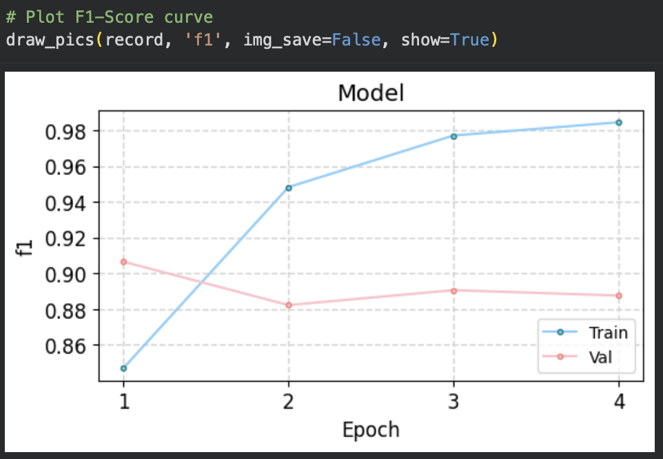
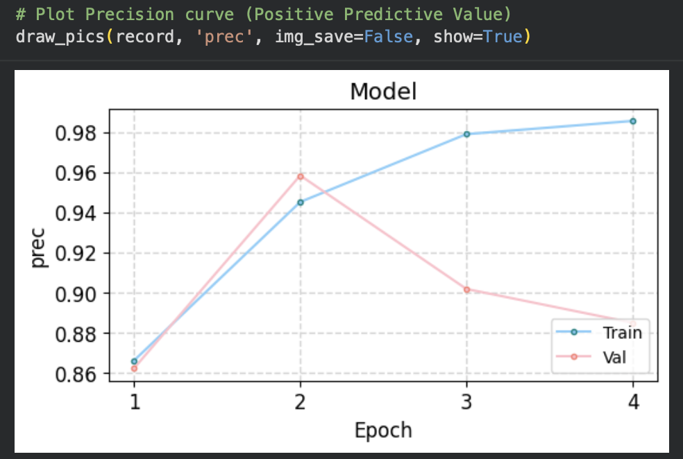
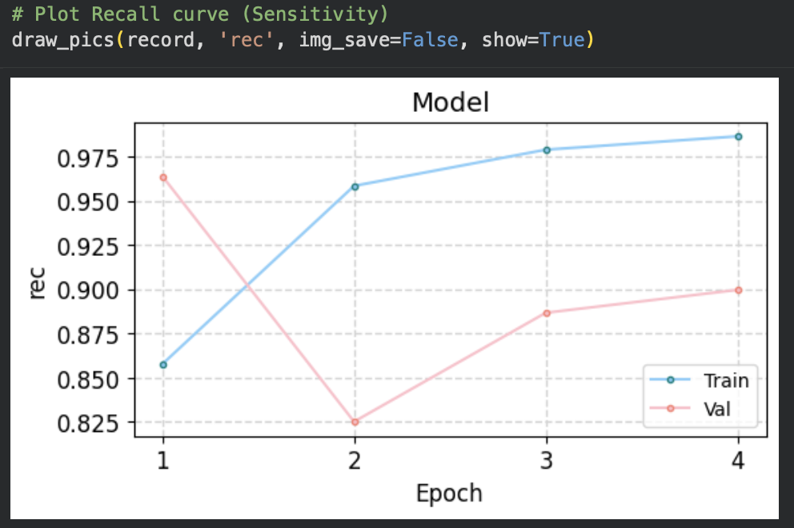
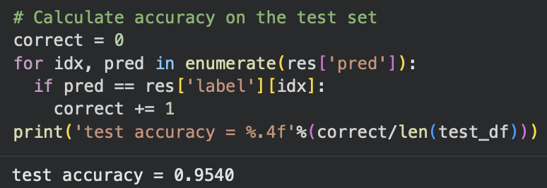

# BERT IMDB Sentiment Analysis

[](https://www.python.org/)
[](https://pytorch.org/)
[](https://huggingface.co/)
[](https://colab.research.google.com/)

## Overview
This project implements a binary sentiment classification system (**Positive** vs. **Negative**) using **BERT (Bidirectional Encoder Representations from Transformers)**. By fine-tuning the `bert-base-uncased` model on the IMDB dataset, this project demonstrates how to leverage **Transfer Learning** to achieve state-of-the-art accuracy in NLP tasks with minimal training epochs.

## Dataset
The model is trained on the **IMDB Large Movie Review Dataset**.
- **Source**: [Hugging Face Datasets](https://huggingface.co/datasets/imdb)
- **Content**: 50,000 highly polar movie reviews.
- **Split Strategy** (Stratified):
    - **Train**: 80% (20,000 samples)
    - **Validation**: 10% (2,500 samples)
    - **Test**: 10% (2,500 samples)
- **Preprocessing**: Dynamic tokenization with padding/truncation (max length 512).

## Methodology
### Model Architecture
The system adds a task-specific classification head on top of the pre-trained BERT encoder:
1.  **Input**: Tokenized text (Input IDs, Attention Mask).
2.  **Encoder**: `BertModel` extracts 768-dimensional contextual embeddings from the `[CLS]` token.
3.  **Regularization**: A **Dropout layer (p=0.1)** is applied to prevent overfitting.
4.  **Classifier**: A **Linear layer (768 → 2)** maps embeddings to unnormalized logits.

### Pipeline Flow


## Results & Performance
The model was fine-tuned for **4 epochs**. The final evaluation on the unseen **Test Set** yielded the following results:

| Metric | Score | Note |
| :--- | :--- | :--- |
| **Accuracy** | **95.40%** | High generalization capability |
| **F1-Score** | ~0.95 | Balanced precision and recall |
| **Precision** | ~0.94 | High positive predictive value |
| **Recall** | ~0.96 | High sensitivity |

### Performance Visualization

### 1. Model Convergence (Loss & Accuracy)
Monitoring the training process to ensure the model learns without overfitting.
* **Loss Curve**: Shows the Cross-Entropy Loss decreasing steadily.
* **Accuracy Curve**: Validation accuracy reaches a plateau, indicating good generalization.


*Fig 1. Cross-Entropy Loss Curve*


*Fig 2. Accuracy Curve*

### 2. Detailed Metrics (F1, Precision, Recall)
Since accuracy alone can be misleading in imbalanced datasets, we also monitor F1-score, Precision, and Recall.
* **F1-Score**: ~90% on validation, showing a good balance between precision and recall.


*Fig 3. F1-Score Curve*


*Fig 4. Precision Curve*


*Fig 5. Recall Curve*

#### 3. Final Test Result
The model achieved **95.40% accuracy** on the unseen test dataset.


*Fig 6. Final Test Accuracy Output*

## Quick Start

### 1. Installation
Clone the repository and install the required dependencies:
```bash
git clone https://github.com/Noora66612/bert-imdb-sentiment-analysis.git
cd bert-imdb-sentiment
pip install torch transformers datasets pandas scikit-learn matplotlib
```
### 2. Training
To reproduce the training process (GPU recommended):
```bash
# This script loads the data, fine-tunes BERT, and saves the model to 'bert.pt'
python bert_imdb_sentiment_analysis.py
```

### 3. Inference Usage
Use the fine-tuned model to predict sentiment on new text:
```python
from model import predict_one, load_checkpoint

# Load the trained model
model = load_checkpoint('./bert.pt', init_model, device)

# Predict
text = "The cinematography was breathtaking, but the plot fell flat."
prob, label = predict_one(text, model)

print(f"Sentiment: {label}")
print(f"Confidence: {prob}")
```

## Configuration
Hyperparameters and training settings are defined in the parameters dictionary within the script:

```python
parameters = {
    "model_name": 'BERT',
    "config": 'bert-base-uncased',
    "learning_rate": 2e-5,  # Optimized for BERT fine-tuning
    "epochs": 4,
    "max_len": 512,         # Maximum sequence length
    "batch_size": 16,
    "dropout": 0.3          # Regularization strength
}
```

## Project Structure
```text
.
├── assets/             # Performance plots and result screenshots
│   ├── loss_curve.png
│   ├── acc_curve.png
│   ├── f1_curve.png
│   ├── precision_curve.png
│   ├── recall_curve.png
│   └── test_result.png
├── data/               # Processed train/test splits (generated during runtime)
├── bert-imdb.ipynb     # Main Jupyter Notebook
├── bert.pt             # Trained model weights (excluded from git)
└── README.md           # Project documentation
```

## References
BERT Paper: Devlin et al. (2018). BERT: Pre-training of Deep Bidirectional Transformers for Language Understanding

Dataset: Maas et al. (2011). Learning Word Vectors for Sentiment Analysis

Library: Hugging Face Transformers Documentation
